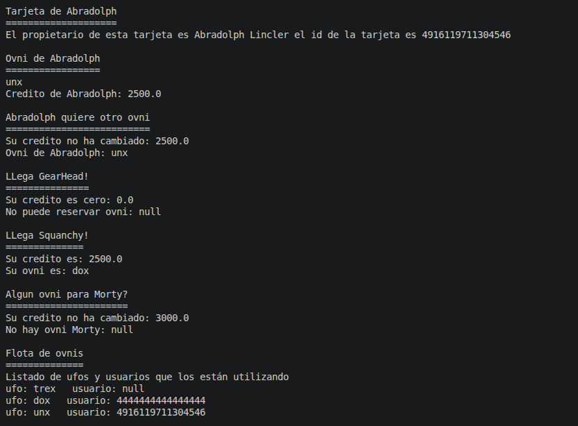
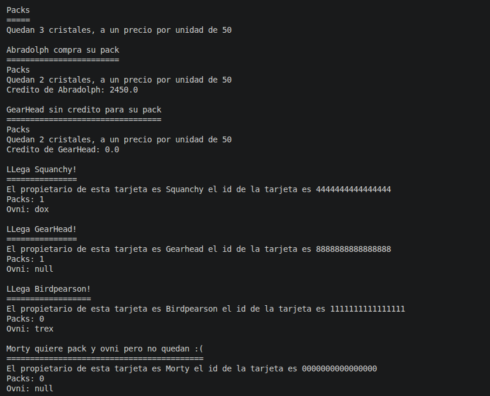

# RICKSY BUSINESS

Este proyecto consiste en simular un servicio de cobro y asignación de servicios en la fiesta interdimensional de Morty. Para esto se utilizará el lenguaje de programación Java, el software de control de versiones Git y el gestor de proyectos Gradle.

## Salida por consola

Esta debería ser la salida por consola de programa

Adquisición de ovnis

Compra de cristales

